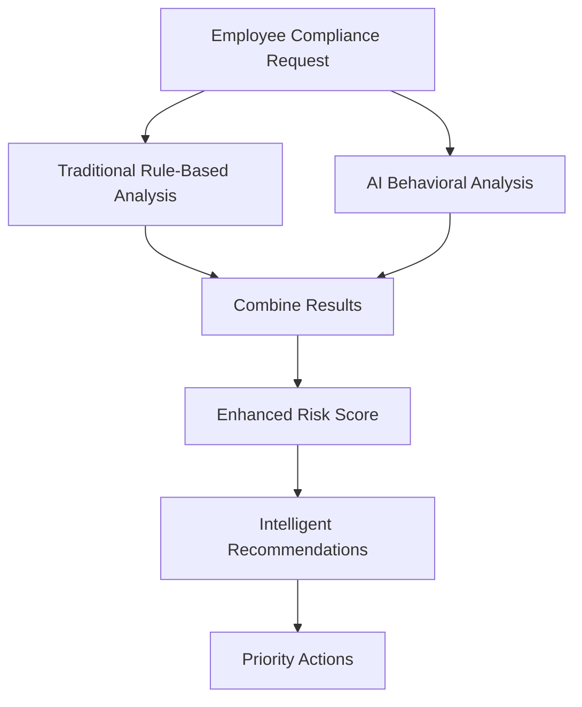
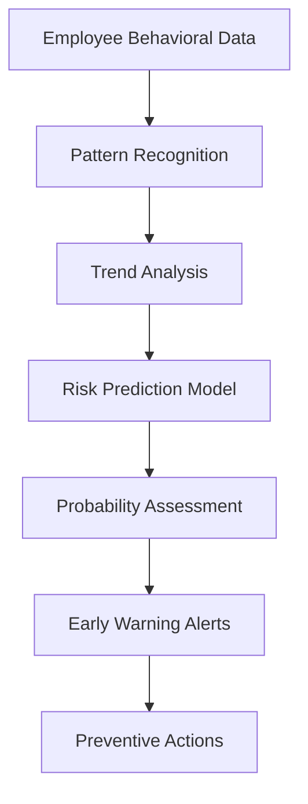

# 🤖 AI-Enhanced Compliance Analysis

## Overview

SecureWatch now includes **AI-powered compliance analysis** that enhances traditional rule-based compliance evaluation with intelligent behavioral analysis, contextual understanding, and predictive risk assessment.

## 🚀 Key Features

### **1. Intelligent Behavioral Analysis**
- **Pattern Recognition**: AI analyzes employee behavior patterns for compliance risks
- **Anomaly Detection**: Identifies unusual data access, communication, and temporal patterns
- **Volume Analysis**: Detects suspicious spikes in email, file access, or external communications
- **Deviation Analysis**: Compares current behavior against historical baselines

### **2. Contextual Compliance Assessment**
- **Nuanced Understanding**: AI interprets compliance context beyond simple rule violations
- **Intent Analysis**: Understands the intent behind actions, not just rule violations
- **Situational Factors**: Considers employee role, data sensitivity, and operational context
- **Regulatory Nuances**: Human-like interpretation of complex regulatory requirements

### **3. Predictive Risk Assessment**
- **Future Violation Prediction**: Identifies employees at risk of future compliance violations
- **Trend Analysis**: Analyzes behavioral changes and escalation patterns
- **Early Warning System**: Provides probabilistic risk assessments with confidence intervals
- **Preventive Recommendations**: Suggests interventions before violations occur

### **4. AI-Enhanced Regulation Analysis**
- **GDPR Intelligence**: Smart interpretation of data protection requirements
- **SOX Compliance**: Behavioral analysis for financial reporting compliance
- **HIPAA Assessment**: Healthcare data protection pattern analysis
- **PCI DSS Evaluation**: Payment data security behavioral monitoring

## 🛠 Technical Implementation

### **AI Service Architecture**

```
🤖 AIComplianceAnalyzer
├── 📧 Email Pattern Analysis
├── 🧠 Behavioral Pattern Recognition  
├── 🎯 Contextual Risk Assessment
├── 🔮 Predictive Risk Modeling
├── 📊 Intelligent Scoring
└── 💡 Smart Recommendations
```

### **Enhanced Compliance Engine**

```
🛡️ ComplianceEngine (Enhanced)
├── 📋 Traditional Rule-Based Evaluation
├── 🤖 AI-Powered Analysis Integration
├── 🔄 Hybrid Scoring Algorithm
├── 📈 Predictive Risk Assessment
└── 🎯 Priority Action Generation
```

## 📡 API Endpoints

### **AI-Enhanced Employee Evaluation**
```http
GET /api/compliance/ai/employees/:id/evaluate
```
**Parameters:**
- `include_predictive`: Enable predictive analysis (default: true)

**Response:**
```json
{
  "evaluation": {
    "aiEnhanced": true,
    "intelligentRiskScore": 75,
    "behavioralAnalysis": {...},
    "contextualViolations": [...],
    "predictiveRisks": [...],
    "aiRecommendations": [...],
    "enhancedOverallStatus": "needs_attention"
  }
}
```

### **Batch AI Compliance Evaluation**
```http
POST /api/compliance/ai/batch-evaluate
```
**Body:**
```json
{
  "employee_ids": [1, 2, 3],
  "include_predictive": true,
  "batch_size": 5
}
```

### **Predictive Risk Assessment**
```http
GET /api/compliance/ai/predictive-risks?department=IT
```

**Response:**
```json
{
  "assessment": {
    "totalEmployeesAnalyzed": 20,
    "employeesWithPredictedRisks": 5,
    "riskAssessments": [...]
  },
  "insights": {
    "riskDistribution": {...},
    "departmentBreakdown": {...}
  }
}
```

### **AI Status and Capabilities**
```http
GET /api/compliance/ai/status
```

## ⚙️ Configuration

### **Environment Variables**

Add to your `.env` file:

```bash
# AI Compliance Configuration
ENABLE_AI_COMPLIANCE=true
OPENAI_API_KEY=your-openai-api-key-here
AI_COMPLIANCE_MODEL=gpt-4o-mini
AI_COMPLIANCE_TEMPERATURE=0.2
AI_COMPLIANCE_MAX_TOKENS=2000
AI_BATCH_SIZE=5
AI_REQUEST_DELAY_MS=1000
```

### **Compliance Profiles Enhancement**

AI analysis automatically considers:
- **Employee Role Context**: Job function impact on compliance requirements
- **Data Classification**: Sensitivity levels (public, internal, confidential, restricted)
- **Monitoring Level**: Compliance profile monitoring intensity
- **Regulatory Scope**: Applicable regulations (GDPR, SOX, HIPAA, PCI DSS)

## 🧠 AI Analysis Components

### **1. Behavioral Pattern Analysis**
```javascript
{
  "dataAccessPatterns": {
    "volumeAnomalies": [...],
    "timeAnomalies": [...],
    "accessPatterns": [...]
  },
  "communicationPatterns": {
    "externalSharing": 0-100,
    "contentRisk": 0-100,
    "recipientAnomalies": [...]
  },
  "temporalPatterns": {
    "afterHoursActivity": 0-100,
    "weekendActivity": 0-100,
    "behaviorShifts": [...]
  }
}
```

### **2. Contextual Violations**
```javascript
{
  "contextualViolations": [
    {
      "type": "data_sharing_anomaly",
      "severity": "medium",
      "contextualFactors": [...],
      "regulationRelevance": ["gdpr"],
      "policyRelevance": ["data_retention"]
    }
  ]
}
```

### **3. Predictive Risks**
```javascript
{
  "predictiveRisks": [
    {
      "riskType": "data_exfiltration",
      "probability": 0.75,
      "timeframe": "2-4 weeks",
      "indicators": [...],
      "preventiveActions": [...]
    }
  ]
}
```

### **4. AI Recommendations**
```javascript
{
  "aiRecommendations": [
    {
      "priority": "high",
      "category": "training",
      "title": "Data Handling Training",
      "description": "Employee shows patterns indicating need for GDPR training",
      "implementation_steps": [...],
      "timeline": "1 week",
      "success_criteria": "Reduced data sharing anomalies"
    }
  ]
}
```

## 📊 Scoring Algorithm

### **Enhanced Risk Scoring**
```
Enhanced Risk Score = 
  (Traditional Compliance Score × 0.6) + 
  (AI Behavioral Risk Score × 0.4)

Where:
- Traditional Score: Rule-based compliance evaluation (0-100)
- AI Behavioral Score: Intelligent pattern analysis (0-100)
```

### **Risk Level Classification**
- **🔴 Critical Risk (80-100)**: Immediate investigation required
- **🟠 High Risk (60-79)**: Enhanced monitoring needed
- **🟡 Needs Attention (40-59)**: Review and training recommended
- **🟢 Compliant with Risks (20-39)**: Minor risks identified
- **✅ Compliant (0-19)**: No significant risks detected

## 🔄 Integration Workflow

### **1. Traditional + AI Evaluation**


### **2. Predictive Analysis Pipeline**


## 🎯 Benefits

### **For Compliance Officers**
- **Proactive Risk Management**: Identify issues before they become violations
- **Intelligent Prioritization**: Focus on highest-risk employees and scenarios
- **Contextual Understanding**: Better interpretation of complex compliance situations
- **Predictive Insights**: Prevent violations rather than just detect them

### **For Security Teams**
- **Behavioral Analytics**: Deep insights into employee risk patterns
- **Early Warning System**: Predictive alerts for potential violations
- **Automated Analysis**: Reduce manual compliance review workload
- **Enhanced Accuracy**: AI reduces false positives and improves detection

### **For Organizations**
- **Cost Reduction**: Prevent costly compliance violations
- **Improved Efficiency**: Automated intelligent analysis
- **Better Training**: Data-driven compliance training recommendations
- **Regulatory Confidence**: Enhanced compliance posture with AI insights

## 🚀 Getting Started

### **1. Enable AI Compliance**
```bash
export ENABLE_AI_COMPLIANCE=true
export OPENAI_API_KEY=your-api-key
```

### **2. Test AI Status**
```bash
curl -X GET http://localhost:3001/api/compliance/ai/status \
  -H "Authorization: Bearer $JWT_TOKEN"
```

### **3. Run AI-Enhanced Evaluation**
```bash
curl -X GET http://localhost:3001/api/compliance/ai/employees/1/evaluate \
  -H "Authorization: Bearer $JWT_TOKEN"
```

### **4. Generate Predictive Risk Report**
```bash
curl -X GET http://localhost:3001/api/compliance/ai/predictive-risks \
  -H "Authorization: Bearer $JWT_TOKEN"
```

## 🔍 Monitoring and Analytics

### **AI Performance Metrics**
- **Analysis Success Rate**: Percentage of successful AI evaluations
- **Prediction Accuracy**: Accuracy of predictive risk assessments
- **False Positive Rate**: AI-enhanced false positive reduction
- **Processing Time**: AI analysis performance metrics

### **Compliance Insights**
- **Risk Trend Analysis**: Organizational compliance risk trends
- **Department Comparisons**: AI-powered department risk analysis
- **Behavioral Patterns**: Organizational behavioral compliance patterns
- **Predictive Analytics**: Future compliance risk projections

## 🛡️ Security and Privacy

### **Data Protection**
- **Minimal Data Processing**: Only analyze compliance-relevant data
- **Secure API Integration**: Encrypted communication with AI services
- **Data Retention Limits**: Comply with data retention policies
- **Privacy by Design**: AI analysis respects employee privacy

### **AI Model Security**
- **Consistent Temperature**: Low temperature for deterministic analysis
- **Prompt Engineering**: Secure, compliance-focused prompts
- **Error Handling**: Graceful fallback to traditional analysis
- **Rate Limiting**: Respect AI service limits and costs

## 📈 Future Enhancements

### **Planned Features**
- **Custom AI Models**: Organization-specific compliance models
- **Real-time Analysis**: Live behavioral compliance monitoring
- **Integration Expansion**: Additional data sources for analysis
- **Advanced Predictions**: Longer-term compliance risk forecasting

### **Research Areas**
- **Federated Learning**: Privacy-preserving AI model training
- **Explainable AI**: Better understanding of AI compliance decisions
- **Continuous Learning**: AI model improvement from compliance outcomes
- **Cross-organizational Benchmarking**: Industry compliance comparisons

---

**🤖 AI-Enhanced Compliance Analysis is now active in SecureWatch!**

Transform your compliance management from reactive rule-checking to proactive, intelligent risk assessment with the power of artificial intelligence. 