# 🔄 Sync-Triggered AI Compliance Analysis - Connector Implementation Status

## 📊 **Implementation Coverage**

### ✅ **FULLY IMPLEMENTED**

#### **1. Office 365 Connector** ✅
**File:** `backend/src/services/office365Connector.js`
- ✅ Import: `const { syncComplianceAnalyzer } = require('./syncComplianceAnalyzer')`
- ✅ Implementation: Queues employees after email processing
- ✅ Integration: `await syncComplianceAnalyzer.queueEmployeeForAnalysis(employeeId, 'office365_email_sync')`
- ✅ Employee lookup: By email address
- ✅ Trigger: After each email is processed and stored

**Trigger Code:**
```javascript
// Queue employee for AI compliance analysis (sync-triggered)
if (employeeId) {
  await syncComplianceAnalyzer.queueEmployeeForAnalysis(employeeId, 'office365_email_sync');
}
```

#### **2. Google Workspace Connector** ✅ 
**File:** `backend/src/services/googleWorkspaceConnector.js`
- ✅ Import: `const { syncComplianceAnalyzer } = require('./syncComplianceAnalyzer')`
- ✅ Implementation: Queues employees after Gmail message processing
- ✅ Integration: `await syncComplianceAnalyzer.queueEmployeeForAnalysis(employeeId, 'google_workspace_sync')`
- ✅ Employee lookup: By email address from message sender
- ✅ Trigger: After each Gmail message is processed and stored

**Trigger Code:**
```javascript
// 🆕 Queue employee for AI compliance analysis (sync-triggered)
if (parsedMessage.from) {
  try {
    const employeeResult = await query(`SELECT id FROM employees WHERE email = $1`, [parsedMessage.from]);
    if (employeeResult.rows.length > 0) {
      const employeeId = employeeResult.rows[0].id;
      await syncComplianceAnalyzer.queueEmployeeForAnalysis(employeeId, 'google_workspace_sync');
    }
  } catch (employeeError) {
    console.warn(`⚠️ Could not queue employee for compliance analysis: ${employeeError.message}`);
  }
}
```

#### **3. Teams Connector** ✅
**File:** `backend/src/services/teamsConnector.js`
- ✅ Import: `const { syncComplianceAnalyzer } = require('./syncComplianceAnalyzer')`
- ✅ Implementation: Queues employees after Teams message processing
- ✅ Integration: `await syncComplianceAnalyzer.queueEmployeeForAnalysis(employeeId, 'teams_sync')`
- ✅ Employee lookup: By email address from Teams user
- ✅ Trigger: After each Teams message is processed and stored

**Trigger Code:**
```javascript
// 🆕 Queue employee for AI compliance analysis (sync-triggered)
if (message.from?.user?.mail || message.from?.user?.userPrincipalName) {
  try {
    const userEmail = message.from.user.mail || message.from.user.userPrincipalName;
    const employeeResult = await query(`SELECT id FROM employees WHERE email = $1`, [userEmail]);
    if (employeeResult.rows.length > 0) {
      const employeeId = employeeResult.rows[0].id;
      await syncComplianceAnalyzer.queueEmployeeForAnalysis(employeeId, 'teams_sync');
    }
  } catch (employeeError) {
    console.warn(`⚠️ Could not queue employee for compliance analysis: ${employeeError.message}`);
  }
}
```

---

## 📁 **Other Connector Files**

### **✅ Office 365 Enhanced Connector**
**File:** `backend/src/services/office365ConnectorEnhanced.js`
- **Purpose:** User sync with compliance profiles (not message processing)
- **Status:** ✅ No sync analysis needed - handles user/employee sync only
- **Note:** This connector doesn't process messages, so no AI compliance analysis required

---

## 🔄 **Sync Analysis Workflow**

### **Process Flow for All Connectors:**

```mermaid
graph LR
    A[📧 Message Synced] --> B[🤖 Email Risk Analysis]
    B --> C[💾 Store Message + Risk Score]
    C --> D[👤 Find Employee by Email]
    D --> E[📋 Queue for AI Compliance Analysis]
    E --> F[⚙️ Background Batch Processing]
    F --> G[🧠 AI Behavioral Analysis]
    G --> H[🚨 Generate Alerts if High Risk]
```


### **Trigger Sources:**
- **`office365_email_sync`** - Office 365 email processing
- **`google_workspace_sync`** - Google Workspace Gmail processing  
- **`teams_sync`** - Microsoft Teams message processing

---

## 📊 **Integration Summary**

| Connector | Type | Sync Analysis | Trigger Source | Employee Lookup |
|-----------|------|---------------|----------------|-----------------|
| **Office 365** | Email | ✅ Implemented | `office365_email_sync` | By sender email |
| **Google Workspace** | Gmail | ✅ Implemented | `google_workspace_sync` | By sender email |
| **Teams** | Messages | ✅ Implemented | `teams_sync` | By user email |
| **O365 Enhanced** | User Sync | N/A | N/A | N/A |

---

## 🎯 **Benefits Achieved**

### **✅ Complete Coverage**
- **All message processing connectors** now trigger AI compliance analysis
- **Consistent implementation** across all platforms
- **Automated employee queuing** after every message sync

### **⚡ Performance Optimized**
- **Non-blocking processing** - sync speed maintained
- **Batch AI analysis** - Efficient API usage
- **Error handling** - Graceful fallback if employee not found

### **🔍 Intelligent Monitoring**
- **Per-connector tracking** - Know which system triggered analysis
- **Employee-centric analysis** - All communication channels analyzed
- **Real-time queuing** - Immediate response to message activity

---

## 📡 **API Endpoints for Monitoring**

### **Check Sync Analysis Status:**
```bash
GET /api/compliance/sync/status
```

### **View Sync Analysis Statistics:**
```json
{
  "queueStatus": {
    "queueSize": 12,
    "processing": true,
    "enabled": true
  },
  "statistics": {
    "total_analyses": 1580,
    "analyses_24h": 94,
    "avg_ai_risk_score": 38.2
  }
}
```

### **View Sync-Triggered Alerts:**
```bash
GET /api/compliance/sync/alerts
```

### **Manually Trigger Analysis:**
```bash
POST /api/compliance/sync/analyze-recent
POST /api/compliance/sync/queue-employees
```

---

## 🚀 **Testing Integration**

### **Test Each Connector:**

1. **Office 365 Sync:**
```bash
POST /api/integrations/office365/sync-emails
# ✅ Should trigger AI compliance analysis automatically
```

2. **Google Workspace Sync:**
```bash
POST /api/integrations/google-workspace/sync-gmail
# ✅ Should trigger AI compliance analysis automatically
```

3. **Teams Sync:**
```bash
POST /api/integrations/teams/sync-messages
# ✅ Should trigger AI compliance analysis automatically
```

### **Monitor Results:**
```bash
# Check sync analysis queue
GET /api/compliance/sync/status

# View generated alerts
GET /api/compliance/sync/alerts

# Check individual employee AI analysis
GET /api/compliance/ai/employees/:id/evaluate
```

---

## 🎉 **Result: 100% Coverage**

**✅ ALL CONNECTORS** now have sync-triggered AI compliance analysis implemented:

- **📧 Office 365** - Email sync triggers AI compliance analysis
- **📧 Google Workspace** - Gmail sync triggers AI compliance analysis  
- **💬 Teams** - Message sync triggers AI compliance analysis

**Every message processed by any connector automatically queues the employee for comprehensive AI compliance analysis!** 🤖✨

**🎯 Complete automation achieved across all communication platforms!** 