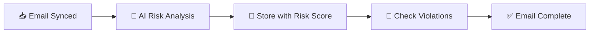
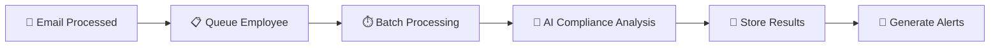

# 🔄 Analysis Timing in SecureWatch

## **When Does Analysis Happen?**

SecureWatch now has **multiple types of analysis** that happen at different times. Here's a complete breakdown:

---

## 📧 **Email Risk Analysis** ✅ **DURING SYNC**

**Individual email analysis happens IMMEDIATELY during sync:**



**What happens:**
- ✅ **Real-time analysis** as each email is processed
- ✅ **Risk scoring** (0-100) applied immediately  
- ✅ **Pattern detection** for suspicious content
- ✅ **Violation flagging** for policy breaches
- ✅ **Results stored** with the email immediately

**Example from Office 365 sync:**
```javascript
// During processEmail() - happens for EVERY email
const analysis = await emailRiskAnalyzer.analyzeEmail({
  subject: emailData.subject,
  bodyText: emailData.bodyText,
  recipients: emailData.recipients
});

// Email stored WITH analysis results immediately
await this.storeEmailInDatabase(emailData, analysis, employeeId);
```

---

## 🤖 **AI Compliance Analysis** ✅ **NOW SYNC-TRIGGERED**

**Employee-level AI compliance analysis now happens AUTOMATICALLY after email processing:**



**What happens:**
- ✅ **Automatic queuing** after each email is processed
- ✅ **Batch processing** to manage AI API limits (5 employees per batch)
- ✅ **Comprehensive analysis** including behavioral patterns, contextual violations, predictive risks
- ✅ **Intelligent alerting** for high-risk findings
- ✅ **Background processing** doesn't slow down sync

**Example sync integration:**
```javascript
// Office 365 Connector - after email processing
await this.checkForViolations(emailData, analysis, employeeId);

// 🆕 NEW: Queue for AI compliance analysis
if (employeeId) {
  await syncComplianceAnalyzer.queueEmployeeForAnalysis(employeeId, 'office365_email_sync');
}
```

---

## ⏰ **Analysis Timeline**

### **Real-Time (0-5 seconds)**
- 📧 **Email risk analysis** - Immediate during sync
- 🚨 **Violation detection** - Immediate email-level alerts
- 💾 **Email storage** - With analysis results

### **Near Real-Time (1-3 minutes)**  
- 📋 **Employee queuing** - Added to AI analysis queue
- 🤖 **AI compliance analysis** - Batch processing every 1-2 minutes
- 🧠 **Behavioral pattern analysis** - Employee-level intelligence

### **Background (3-10 minutes)**
- 🔮 **Predictive risk analysis** - Future violation prediction
- 📊 **Compliance reporting** - Updated risk scores and trends
- 🚨 **High-risk alerting** - Critical findings generate immediate alerts

---

## 🎛️ **Sync Analysis Configuration**

### **Environment Variables:**
```bash
# Enable sync-triggered AI compliance analysis
ENABLE_SYNC_COMPLIANCE_ANALYSIS=true

# Batch processing configuration
SYNC_ANALYSIS_BATCH_SIZE=5           # Employees per batch
SYNC_ANALYSIS_DELAY_MS=2000          # Delay between batches

# AI API configuration
OPENAI_API_KEY=your-api-key-here
AI_COMPLIANCE_MODEL=gpt-4o-mini
```

### **Control Endpoints:**
```bash
# Check sync analysis status
GET /api/compliance/sync/status

# Manually trigger analysis for recent activity
POST /api/compliance/sync/analyze-recent

# Queue specific employees
POST /api/compliance/sync/queue-employees

# View sync-triggered alerts
GET /api/compliance/sync/alerts
```

---

## 📊 **Analysis Types Comparison**

| Analysis Type | When | Scope | Speed | Purpose |
|---------------|------|-------|-------|---------|
| **Email Risk Analysis** | During Sync | Individual Emails | Real-time | Immediate threat detection |
| **AI Compliance Analysis** | After Sync (Queued) | Employee Behavior | Near real-time | Comprehensive compliance assessment |
| **Predictive Risk Analysis** | Background | Future Risks | Background | Prevention and early warning |
| **Manual Analysis** | On-demand | Custom Scope | Manual | Deep investigation and reporting |

---

## 🔄 **Sync Workflow Enhancement**

### **Before (Email Only):**
```
📥 Sync Email → 🤖 Analyze Email → 💾 Store → ✅ Done
```

### **After (Email + Compliance):**
```
📥 Sync Email → 🤖 Analyze Email → 💾 Store → 
📋 Queue Employee → 🧠 AI Compliance Analysis → 
🚨 Generate Alerts → 📊 Update Dashboards
```

---

## 🎯 **Benefits of Sync-Triggered Analysis**

### **✅ Proactive Risk Management**
- **Immediate detection** of email-level risks
- **Rapid identification** of employee-level compliance issues
- **Early warning** for potential future violations

### **⚡ Optimal Performance**
- **Non-blocking sync** - AI analysis doesn't slow down email import
- **Batch processing** - Efficient use of AI API resources
- **Queue management** - Handles high-volume sync scenarios

### **🎯 Comprehensive Coverage**
- **Every employee** with email activity gets analyzed
- **Automatic analysis** - No manual intervention required
- **Real-time updates** - Compliance status always current

### **🔍 Intelligent Alerting**
- **High-risk findings** generate immediate alerts
- **Predictive warnings** for potential future issues
- **Contextual insights** beyond simple rule violations

---

## 📈 **Analysis Statistics**

### **Sync Analysis Metrics:**
```json
{
  "analyses": {
    "total_analyses": 1250,
    "analyses_24h": 87,
    "avg_risk_score": 42.3,
    "high_risk_employees": 23
  },
  "alerts": {
    "total_alerts": 156,
    "active_alerts": 12,
    "critical_alerts": 3,
    "avg_resolution_hours": 4.2
  },
  "queueStatus": {
    "queueSize": 5,
    "processing": true,
    "enabled": true
  }
}
```

---

## 🚀 **Getting Started**

### **1. Enable Sync Analysis**
```bash
export ENABLE_SYNC_COMPLIANCE_ANALYSIS=true
export OPENAI_API_KEY=your-api-key
```

### **2. Run Email Sync**
```bash
# Office 365 sync with automatic compliance analysis
POST /api/integrations/office365/sync-emails
```

### **3. Monitor Analysis**
```bash
# Check sync analysis status
GET /api/compliance/sync/status

# View generated alerts
GET /api/compliance/sync/alerts
```

### **4. Review Results**
```bash
# Get AI-enhanced compliance evaluation
GET /api/compliance/ai/employees/:id/evaluate
```

---

## ⚠️ **Important Notes**

### **📧 Email Analysis = Real-Time**
- Happens **during sync** for every email
- Results available **immediately**
- Minimal performance impact

### **🤖 AI Compliance Analysis = Sync-Triggered**
- Happens **after sync** in batches
- Comprehensive behavioral analysis
- Background processing for optimal performance

### **🔮 Predictive Analysis = Background**
- Longer-term trend analysis
- Future risk prediction
- Runs automatically as part of AI compliance analysis

---

**🎉 Result: Complete automation of compliance analysis triggered by email sync, providing real-time email risk detection plus comprehensive AI-powered behavioral compliance assessment!** 